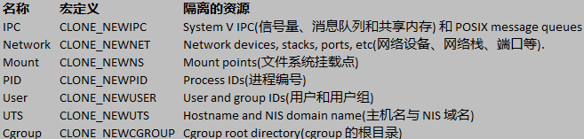
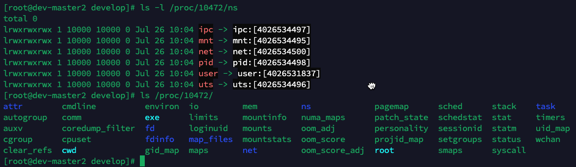
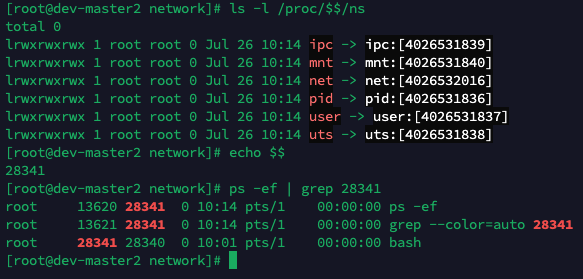
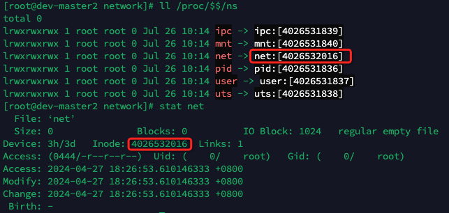
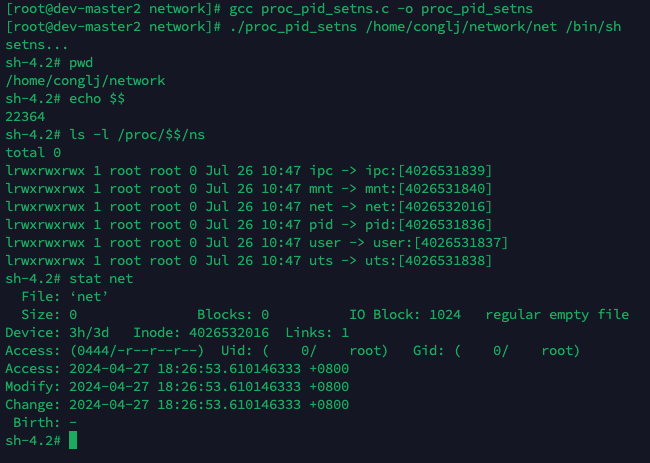

# network namespace
1. UTS namespace
2. IPC namespace
3. PID namespace
4. network namespace
5. user namespace
6. Mount namespace
7. veth pair



```
# ls /var/run/netns

# ip netns add netns1

# ls /var/run/netns
netns1

# ip netns exec netns1 ip link list
1: lo: <LOOPBACK> mtu 65536 qdisc noop state DOWN mode DEFAULT group default qlen 1000
    link/loopback 00:00:00:00:00:00 brd 00:00:00:00:00:00
2: tunl0@NONE: <NOARP> mtu 1480 qdisc noop state DOWN mode DEFAULT group default qlen 1000
    link/ipip 0.0.0.0 brd 0.0.0.0

# ip netns list
netns1

# ip netns delete netns1
# ip netns list

ls /var/run/netns

```

```
# ip netns add netns1
# ip netns exec netns1 ping 127.0.0.1
ping: connect: Network is unreachable

# ip netns exec netns1 ip link set dev lo up
# ip netns exec netns1 ip link list
1: lo: <LOOPBACK,UP,LOWER_UP> mtu 65536 qdisc noqueue state UNKNOWN mode DEFAULT group default qlen 1000
    link/loopback 00:00:00:00:00:00 brd 00:00:00:00:00:00
2: tunl0@NONE: <NOARP> mtu 1480 qdisc noop state DOWN mode DEFAULT group default qlen 1000
    link/ipip 0.0.0.0 brd 0.0.0.0

# ip netns exec netns1 ping 127.0.0.1
PING 127.0.0.1 (127.0.0.1) 56(84) bytes of data.
64 bytes from 127.0.0.1: icmp_seq=1 ttl=64 time=0.017 ms
64 bytes from 127.0.0.1: icmp_seq=2 ttl=64 time=0.028 ms
```

仅有一个本地回环lo没法与外面通信，创建veth0和veth1一堆虚拟以太网卡。
```
# ip link add veth0 type veth peer name veth1
# ip netns exec netns1 ifconfig veth1 10.1.1.1/24 up
# ifconfig veth0 10.1.1.2/24 up

# ping 10.1.1.1
PING 10.1.1.1 (10.1.1.1) 56(84) bytes of data.
64 bytes from 10.1.1.1: icmp_seq=1 ttl=64 time=0.066 ms
64 bytes from 10.1.1.1: icmp_seq=2 ttl=64 time=0.047 ms

# ip netns exec netns1 ping 10.1.1.2
PING 10.1.1.2 (10.1.1.2) 56(84) bytes of data.
64 bytes from 10.1.1.2: icmp_seq=1 ttl=64 time=0.043 ms

# ip netns exec netns1 route
Kernel IP routing table
Destination     Gateway         Genmask         Flags Metric Ref    Use Iface
10.1.1.0        0.0.0.0         255.255.255.0   U     0      0        0 veth1

# ip netns exec netns1 iptables -L
Chain INPUT (policy ACCEPT)
target     prot opt source               destination         

Chain FORWARD (policy ACCEPT)
target     prot opt source               destination         

Chain OUTPUT (policy ACCEPT)
target     prot opt source               destination
```

移动veth1网卡从netns1到1
```
# ip netns exec netns1 ip link list
1: lo: <LOOPBACK,UP,LOWER_UP> mtu 65536 qdisc noqueue state UNKNOWN mode DEFAULT group default qlen 1000
    link/loopback 00:00:00:00:00:00 brd 00:00:00:00:00:00
2: tunl0@NONE: <NOARP> mtu 1480 qdisc noop state DOWN mode DEFAULT group default qlen 1000
    link/ipip 0.0.0.0 brd 0.0.0.0
89: veth1@if90: <BROADCAST,MULTICAST,UP,LOWER_UP> mtu 1500 qdisc noqueue state UP mode DEFAULT group default qlen 1000
    link/ether e2:b6:6d:c7:73:40 brd ff:ff:ff:ff:ff:ff link-netnsid 0

# ip netns exec netns1 ip link set veth1 netns 1
# ip netns exec netns1 ip link list
1: lo: <LOOPBACK,UP,LOWER_UP> mtu 65536 qdisc noqueue state UNKNOWN mode DEFAULT group default qlen 1000
    link/loopback 00:00:00:00:00:00 brd 00:00:00:00:00:00
2: tunl0@NONE: <NOARP> mtu 1480 qdisc noop state DOWN mode DEFAULT group default qlen 1000
    link/ipip 0.0.0.0 brd 0.0.0.0
```
>&nbsp;&nbsp;&nbsp;&nbsp;&nbsp;&nbsp;&nbsp;对namespace的root用户而言，他们都可以把其namespace里的虚拟网络
设备移动到其他network namespace，甚至包括主机根network namespace！这
就带来了潜在的安全风险。如果用户希望屏蔽这一行为，则需要结合PID
namespace和Mount namespace的隔离特性做到network namespace之间的完全
不可达，感兴趣的读者可以自行查阅相关资料。

namespace存在于 /proc/PID/ns目录下面

看两个进程是否属于同一个namespace就要看中括号里面的数字是否一样。


## 往ns中放进程


```
# touch /home/conglj/network/net
# mount --bind /proc/$$/ns/net /home/conglj/network/net
```



执行setns例子

```
# vim proc_pid_setns.c
```

``` c
#include <stdio.h>
#include <fcntl.h>

int main(int argc, char *argv[])
{
    printf("setns...\n");
    int fd = open(argv[1], O_RDONLY);
    setns(fd, 0);
    execvp(argv[2], &argv[2]);
}
```



这种方式类似于docker和k8s。
> kubernetes网络全网指南 29页

[参考文章](https://www.cnblogs.com/sparkdev/p/9365405.html)

执行这个代码文件
nsDemoP30.c

```
# gcc nsDemoP30.c -o ns && ./ns
-[36212] Hello ?
- [    1] World !
[root@In Namespace 1 network]#
[root@In Namespace 1 network]# ls -l /proc/$$/ns
total 0
lrwxrwxrwx 1 root root 0 Jul 26 12:21 ipc -> ipc:[4026535157]
lrwxrwxrwx 1 root root 0 Jul 26 12:21 mnt -> mnt:[4026535155]
lrwxrwxrwx 1 root root 0 Jul 26 12:21 net -> net:[4026535160]
lrwxrwxrwx 1 root root 0 Jul 26 12:21 pid -> pid:[4026535158]
lrwxrwxrwx 1 root root 0 Jul 26 12:21 user -> user:[4026531837]
lrwxrwxrwx 1 root root 0 Jul 26 12:21 uts -> uts:[4026535156]
[root@In Namespace 1 network]# ifconfig
lo: flags=73<UP,LOOPBACK,RUNNING>  mtu 65536
        inet 127.0.0.1  netmask 255.0.0.0
        inet6 ::1  prefixlen 128  scopeid 0x10<host>
        loop  txqueuelen 1000  (Local Loopback)
        RX packets 0  bytes 0 (0.0 B)
        RX errors 0  dropped 0  overruns 0  frame 0
        TX packets 0  bytes 0 (0.0 B)
        TX errors 0  dropped 0 overruns 0  carrier 0  collisions 0

veth1: flags=4163<UP,BROADCAST,RUNNING,MULTICAST>  mtu 1500
        inet 169.254.1.2  netmask 255.255.255.252  broadcast 0.0.0.0
        inet6 fe80::64eb:3dff:fe61:ba64  prefixlen 64  scopeid 0x20<link>
        ether 66:eb:3d:61:ba:64  txqueuelen 1000  (Ethernet)
        RX packets 19  bytes 3087 (3.0 KiB)
        RX errors 0  dropped 11  overruns 0  frame 0
        TX packets 8  bytes 656 (656.0 B)
        TX errors 0  dropped 0 overruns 0  carrier 0  collisions 0
[root@In Namespace 1 network]# ls -l /proc/1/ns
total 0
lrwxrwxrwx 1 root root 0 Jul 26 12:21 ipc -> ipc:[4026535157]
lrwxrwxrwx 1 root root 0 Jul 26 12:21 mnt -> mnt:[4026535155]
lrwxrwxrwx 1 root root 0 Jul 26 12:21 net -> net:[4026535160]
lrwxrwxrwx 1 root root 0 Jul 26 12:21 pid -> pid:[4026535158]
lrwxrwxrwx 1 root root 0 Jul 26 12:21 user -> user:[4026531837]
lrwxrwxrwx 1 root root 0 Jul 26 12:21 uts -> uts:[4026535156]
[root@In Namespace 1 network]# nc -l 1234

# 新开一个terminal new1
new1# nc 169.254.1.2 1234
# input haha
new1# haha

# 原来的terminal 显示haha
[root@In Namespace 1 network]# nc -l 1234
haha
```