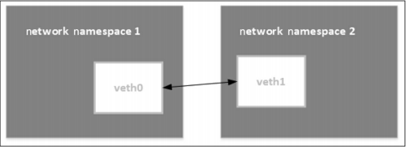
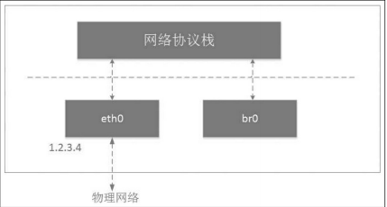
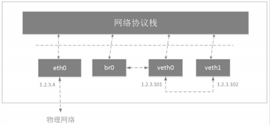

# veth pair
veth pair成对出现，一段发送数据再另一端接收。常用于跨network namespace之间的通信。



使用网桥技术才能将veth pair接收的数据发出去。

```
## 创建veth pair
# ip link add veth0 type veth peer name veth1
# ip link list | grep veth
...
297: veth1@veth0: <BROADCAST,MULTICAST,M-DOWN> mtu 1500 qdisc noop state DOWN mode DEFAULT group default qlen 1000
...
298: veth0@veth1: <BROADCAST,MULTICAST,M-DOWN> mtu 1500 qdisc noop state DOWN mode DEFAULT group default qlen 1000
...
```

> 最大传输单元MTU（Maximum Transmission Unit，MTU），是指网络能够传输的最大数据包大小

```
# ip link set dev veth0 up
# ip link set dev veth1 up

# ip link list | grep veth
...
297: veth1@veth0: <BROADCAST,MULTICAST,UP,LOWER_UP> mtu 1500 qdisc noqueue state UP mode DEFAULT group default qlen 1000
...
298: veth0@veth1: <BROADCAST,MULTICAST,UP,LOWER_UP> mtu 1500 qdisc noqueue state UP mode DEFAULT group default qlen 1000
...
```
<font color=Green>veth pair设备配置IP地址</font>
```
# ifconfig | grep -C 10 veth0
...
veth0: flags=4163<UP,BROADCAST,RUNNING,MULTICAST>  mtu 1500
        inet6 fe80::8021:26ff:fe39:eb32  prefixlen 64  scopeid 0x20<link>
        ether 82:21:26:39:eb:32  txqueuelen 1000  (Ethernet)
        RX packets 8  bytes 656 (656.0 B)
        RX errors 0  dropped 0  overruns 0  frame 0
        TX packets 8  bytes 656 (656.0 B)
        TX errors 0  dropped 0 overruns 0  carrier 0  collisions 0
veth1: flags=4163<UP,BROADCAST,RUNNING,MULTICAST>  mtu 1500
        inet6 fe80::dcca:12ff:fe0f:5a5e  prefixlen 64  scopeid 0x20<link>
        ether de:ca:12:0f:5a:5e  txqueuelen 1000  (Ethernet)
        RX packets 8  bytes 656 (656.0 B)
        RX errors 0  dropped 0  overruns 0  frame 0
        TX packets 8  bytes 656 (656.0 B)
        TX errors 0  dropped 0 overruns 0  carrier 0  collisions 0
# ifconfig veth0 10.20.30.40/24
# ifconfig | grep -C 10 veth0
...
veth0: flags=4163<UP,BROADCAST,RUNNING,MULTICAST>  mtu 1500
        inet 10.20.30.40  netmask 255.255.255.0  broadcast 10.20.30.255
        inet6 fe80::8021:26ff:fe39:eb32  prefixlen 64  scopeid 0x20<link>
        ether 82:21:26:39:eb:32  txqueuelen 1000  (Ethernet)
        RX packets 8  bytes 656 (656.0 B)
        RX errors 0  dropped 0  overruns 0  frame 0
        TX packets 8  bytes 656 (656.0 B)
        TX errors 0  dropped 0 overruns 0  carrier 0  collisions 0
veth1: flags=4163<UP,BROADCAST,RUNNING,MULTICAST>  mtu 1500
        inet6 fe80::dcca:12ff:fe0f:5a5e  prefixlen 64  scopeid 0x20<link>
        ether de:ca:12:0f:5a:5e  txqueuelen 1000  (Ethernet)
        RX packets 8  bytes 656 (656.0 B)
        RX errors 0  dropped 0  overruns 0  frame 0
        TX packets 8  bytes 656 (656.0 B)
        TX errors 0  dropped 0 overruns 0  carrier 0  collisions 0
```
<font color=Green>将veth pair设备放到namespace中</font>
```
# ip link set veth1 netns newns
Error: argument "newns" is wrong: Invalid "netns" value
# ip netns add newns
# ip netns list
newns
# ip link set veth1 netns newns
# ip netns exec newns ip link list
1: lo: <LOOPBACK> mtu 65536 qdisc noop state DOWN mode DEFAULT group default qlen 1000
    link/loopback 00:00:00:00:00:00 brd 00:00:00:00:00:00
2: tunl0@NONE: <NOARP> mtu 1480 qdisc noop state DOWN mode DEFAULT group default qlen 1000
    link/ipip 0.0.0.0 brd 0.0.0.0
297: veth1@if298: <BROADCAST,MULTICAST> mtu 1500 qdisc noop state DOWN mode DEFAULT group default qlen 1000
    link/ether de:ca:12:0f:5a:5e brd ff:ff:ff:ff:ff:ff link-netnsid 0
# ip link list | grep -C 5 veth0
...
298: veth0@if297: <NO-CARRIER,BROADCAST,MULTICAST,UP> mtu 1500 qdisc noqueue state LOWERLAYERDOWN mode DEFAULT group default qlen 1000
...
```
<font color=Green>现在看到297 veth1在newns下面，298 veth0在根。下面给都移动到根</font>
```
# ip netns exec newns ip link set veth1 netns 1
# ip link list | grep -C 5 veth0
...
297: veth1@veth0: <BROADCAST,MULTICAST> mtu 1500 qdisc noop state DOWN mode DEFAULT group default qlen 1000
    link/ether de:ca:12:0f:5a:5e brd ff:ff:ff:ff:ff:ff
...
298: veth0@veth1: <NO-CARRIER,BROADCAST,MULTICAST,UP,M-DOWN> mtu 1500 qdisc noqueue state LOWERLAYERDOWN mode DEFAULT group default qlen 1000
    link/ether 82:21:26:39:eb:32 brd ff:ff:ff:ff:ff:ff
...
```

# 容器与host veth pair关系
经典容器组网模型就是veth pair+bridge的模式。

容器中的eth0和外面host某个veth成对pair关系。

查看映射关系方法1，要一个个去宿主机上找，麻烦。
```
[容器内部]:/# cat /sys/class/net/eth0/iflink 
303
## 宿主机上
# cat /sys/class/net/veth8c4d36d/iflink 
302
## 并且找到的号不是不一样。

方式2:
[容器内部]:# ip link show eth0
302: eth0@if303: <BROADCAST,MULTICAST,UP,LOWER_UP> mtu 1500 qdisc noqueue state UP mode DEFAULT group default 
    link/ether 02:42:14:15:16:02 brd ff:ff:ff:ff:ff:ff link-netnsid 0
[宿主机] # ip link show | grep 303
303: veth8c4d36d@if302: <BROADCAST,MULTICAST,UP,LOWER_UP> mtu 1500 qdisc noqueue master docker0 state UP mode DEFAULT group default

方式3:
[容器内部]:# ethtool -S eth0
NIC statistics:
     peer_ifindex: 303
[宿主机] # ip addr
303: veth8c4d36d@if302: <BROADCAST,MULTICAST,UP,LOWER_UP> mtu 1500 qdisc noqueue master docker0 state UP group default 
    link/ether b2:47:db:b7:23:bd brd ff:ff:ff:ff:ff:ff link-netnsid 44
    inet6 fe80::b047:dbff:feb7:23bd/64 scope link 
       valid_lft forever preferred_lft forever
```

# Linx bridge

两个ns可以通过veth pair连接，两个以上需要用到linux bridge。

网桥有“牵线搭桥”之意，用于连接两个不同的局域网，是网线的延伸。网桥是二层网络设备，两个端口分别有一条独立的交换信道，不共享一条背板总线，可隔离冲突域。网桥比集线器（hub）性能更好，集线器上各个端口都是共享一条背板总线。后来网桥被具有更多端口、可隔离冲突域的交换机（switch）所取代。

```
# ip link add name br0 type bridge
# ip link set br0 up
# brctl addbr br0
device br0 already exists; can't create bridge with the same name
# ip link list | grep br0
305: br0: <BROADCAST,MULTICAST,UP,LOWER_UP> mtu 1500 qdisc noqueue state UNKNOWN mode DEFAULT group default qlen 1000
```



```
# ip link add veth0 type veth peer name veth1
# ip link | grep veth0
43: veth0914dfd@if42: <BROADCAST,MULTICAST,UP,LOWER_UP> mtu 1500 qdisc noqueue master br-e45a21a0ee27 state UP mode DEFAULT group default 
306: veth1@veth0: <BROADCAST,MULTICAST,M-DOWN> mtu 1500 qdisc noop state DOWN mode DEFAULT group default qlen 1000
307: veth0@veth1: <BROADCAST,MULTICAST,M-DOWN> mtu 1500 qdisc noop state DOWN mode DEFAULT group default qlen 1000

# ip addr add 1.2.3.101/24 dev veth0
# ip addr add 1.2.3.102/24 dev veth1
# ip link | grep veth0
43: veth0914dfd@if42: <BROADCAST,MULTICAST,UP,LOWER_UP> mtu 1500 qdisc noqueue master br-e45a21a0ee27 state UP mode DEFAULT group default 
308: veth1@veth0: <BROADCAST,MULTICAST,M-DOWN> mtu 1500 qdisc noop state DOWN mode DEFAULT group default qlen 1000
309: veth0@veth1: <BROADCAST,MULTICAST,M-DOWN> mtu 1500 qdisc noop state DOWN mode DEFAULT group default qlen 1000

# ip link set veth0 up
# ip link set veth1 up

# ip link | grep veth0
43: veth0914dfd@if42: <BROADCAST,MULTICAST,UP,LOWER_UP> mtu 1500 qdisc noqueue master br-e45a21a0ee27 state UP mode DEFAULT group default 
308: veth1@veth0: <BROADCAST,MULTICAST,UP,LOWER_UP> mtu 1500 qdisc noqueue state UP mode DEFAULT group default qlen 1000
309: veth0@veth1: <BROADCAST,MULTICAST,UP,LOWER_UP> mtu 1500 qdisc noqueue state UP mode DEFAULT group default qlen 1000

## 将veth0连接到br0上
# ip link set dev veth0 master br0
# brctl addif br0 veth0
device veth0 is already a member of a bridge; can't enslave it to bridge br0.

## 第一个命令没看到网桥内容
# bridge link list
CNI bridge plugin v1.1.1

# brctl show
bridge name     bridge id               STP enabled     interfaces
br-e45a21a0ee27         8000.0242837c546c       no              veth0914dfd
                                                        veth1a7402d
                                                        veth5622f29
                                                        veth5e657d9
                                                        veth87dc338
                                                        vetha76ff85
                                                        vetha91b64e
                                                        vethb7c8db8
                                                        vethe2837e9
                                                        vethe2f7586
br0             8000.02896ea86ca9       no              veth0
docker0         8000.0242fd8c0128       no
```
网络拓扑如图



```
# ifconfig | grep -C 7 1.2.3
...
veth0: flags=4163<UP,BROADCAST,RUNNING,MULTICAST>  mtu 1500
        inet 1.2.3.101  netmask 255.255.255.0  broadcast 0.0.0.0
        inet6 fe80::89:6eff:fea8:6ca9  prefixlen 64  scopeid 0x20<link>
        ether 02:89:6e:a8:6c:a9  txqueuelen 1000  (Ethernet)
        RX packets 8  bytes 656 (656.0 B)
        RX errors 0  dropped 0  overruns 0  frame 0
        TX packets 8  bytes 656 (656.0 B)
        TX errors 0  dropped 0 overruns 0  carrier 0  collisions 0

veth1: flags=4163<UP,BROADCAST,RUNNING,MULTICAST>  mtu 1500
        inet 1.2.3.102  netmask 255.255.255.0  broadcast 0.0.0.0
        inet6 fe80::b88c:5fff:fef0:8e33  prefixlen 64  scopeid 0x20<link>
        ether ba:8c:5f:f0:8e:33  txqueuelen 1000  (Ethernet)
        RX packets 8  bytes 656 (656.0 B)
        RX errors 0  dropped 0  overruns 0  frame 0
        TX packets 8  bytes 656 (656.0 B)
        TX errors 0  dropped 0 overruns 0  carrier 0  collisions 0
```

> br0和veth0相连之后发生了如下变化：
·br0和veth0之间连接起来了，并且是双向的通道；
·协议栈和veth0之间变成了单通道，协议栈能发数据给veth0，但veth0从
外面收到的数据不会转发给协议栈；
·br0的MAC地址变成了veth0的MAC地址。
这就好比Linux bridge在veth0和协议栈之间做了一次拦截，在veth0上面
做了点小动作，将veth0本来要转发给协议栈的数据拦截，全部转发给
bridge。同时，bridge也可以向veth0发数据。

```
## veth0加入bridge ping不通veth1，ping的参数c是完成次数，-I 指定网络界面发送数据包，Interface
# ping -c 1 -I veth0 1.2.3.102
PING 1.2.3.102 (1.2.3.102) from 1.2.3.101 veth0: 56(84) bytes of data.
^C
--- 1.2.3.102 ping statistics ---
1 packets transmitted, 0 received, 100% packet loss, time 0ms

## 抓veth1网卡上的报文
# tcpdump -n -i veth1
tcpdump: verbose output suppressed, use -v or -vv for full protocol decode
listening on veth1, link-type EN10MB (Ethernet), capture size 262144 bytes
17:54:05.464764 ARP, Request who-has 1.2.3.102 tell 1.2.3.101, length 28
17:54:05.464779 ARP, Reply 1.2.3.102 is-at ba:8c:5f:f0:8e:33, length 28
17:54:06.465922 ARP, Request who-has 1.2.3.102 tell 1.2.3.101, length 28
17:54:06.465930 ARP, Reply 1.2.3.102 is-at ba:8c:5f:f0:8e:33, length 28
```
veth0的ARP缓存里没有veth1的MAC地址，所以ping之前先发ARP请求。veth1收到ARP请求返回了应答。
> The Address Resolution Protocol (ARP) is a communication protocol used for discovering the link layer address, such as a MAC address, associated with a given internet layer address, typically an IPv4 address.

抓取veth0网卡上的报文
```
# tcpdump -n -i veth0
tcpdump: verbose output suppressed, use -v or -vv for full protocol decode
listening on veth0, link-type EN10MB (Ethernet), capture size 262144 bytes
18:00:59.921922 ARP, Request who-has 1.2.3.102 tell 1.2.3.101, length 28
18:00:59.921935 ARP, Reply 1.2.3.102 is-at ba:8c:5f:f0:8e:33, length 28
18:01:00.923924 ARP, Request who-has 1.2.3.102 tell 1.2.3.101, length 28
18:01:00.923933 ARP, Reply 1.2.3.102 is-at ba:8c:5f:f0:8e:33, length 28
```
br0的数据包只有应答
```
# tcpdump -n -i br0
tcpdump: verbose output suppressed, use -v or -vv for full protocol decode
listening on br0, link-type EN10MB (Ethernet), capture size 262144 bytes
18:02:14.031429 ARP, Reply 1.2.3.102 is-at ba:8c:5f:f0:8e:33, length 28
18:02:15.033933 ARP, Reply 1.2.3.102 is-at ba:8c:5f:f0:8e:33, length 28
```
veth0收到应答包后没有给协议栈，而是给了br0，于是协议栈得不到veth1的MAC地址，导致通信失败。

# IP让给Linix bridge

veth0配置IP没有意义，让给bridge。

```
# ip addr del
```